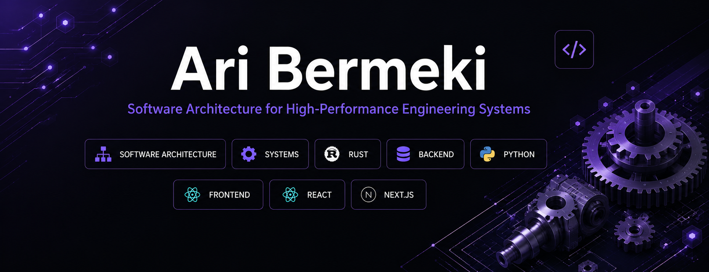
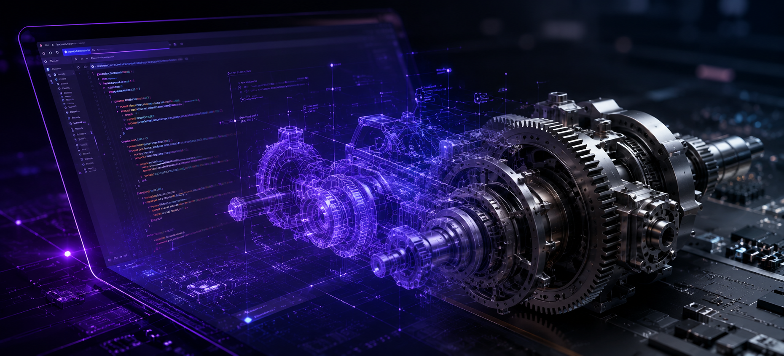

<div align="center">



### Software Engineer · Mechanical Engineering Student

<p>
  
  
  
  
</p>

<p>
  Designing robust software architectures for engineering, desktop, and industrial applications.
</p>

</div>

---

## Profile

I am a software developer and Mechanical Engineering student with a strong interest in the design of reliable, maintainable, and high-performance software systems.

My technical focus lies at the intersection of:

- software architecture,
- systems programming,
- desktop application development,
- engineering software,
- industrial digitalization,
- and human–machine interaction.

I combine software engineering methods with an engineering-oriented approach to problem solving. My long-term objective is to develop software systems that interact with real technical processes, machines, and industrial environments.

---

## Research and Development Interests

<table>
<tr>
<td width="50%" valign="top">

### Software Engineering

- Software Architecture
- Systems Programming
- Event-Driven Systems
- Distributed Systems
- Cross-Platform Runtime Design
- Rust–Python Interoperability
- Desktop Application Frameworks
- API and Backend Architecture

</td>
<td width="50%" valign="top">

### Engineering Applications

- Human–Machine Interfaces
- Engineering Software
- Industrial Digitalization
- Manufacturing Systems
- Technical Process Integration
- Machine-Oriented Applications
- Automation Concepts
- Digital Engineering Workflows

</td>
</tr>
</table>

---
<div align="center">

# TECHNICAL COMPETENCE MATRIX

*A structured overview of my technical domains, technologies, and level of focus.*

</div>

---
<div align="center">
<table>
<thead>
<tr>
<th align="left">DOMAIN</th>
<th align="left">TECHNOLOGIES</th>
<th align="left">LEVEL OF FOCUS</th>
</tr>
</thead>

<tbody>

<tr>
<td valign="middle">

### ⚙️ Systems Programming

</td>
<td valign="middle">


**Rust**

</td>
<td valign="middle">

**Primary**


</td>
</tr>

<tr>
<td valign="middle">

### 🗄️ Backend Development

</td>
<td valign="middle">


**Python · FastAPI**

</td>
<td valign="middle">

**Primary**


</td>
</tr>

<tr>
<td valign="middle">

### 🖥️ Frontend Development

</td>
<td valign="middle">


**React · Next.js**

</td>
<td valign="middle">

**Primary**


</td>
</tr>

<tr>
<td valign="middle">

### 🧩 Additional Frontend

</td>
<td valign="middle">


**Vue.js**

</td>
<td valign="middle">

**Basic**


</td>
</tr>

<tr>
<td valign="middle">

### 🌐 Web Technologies

</td>
<td valign="middle">


**HTML · CSS · JavaScript · TypeScript**

</td>
<td valign="middle">

**Applied**


</td>
</tr>

<tr>
<td valign="middle">

### 🧱 Architecture

</td>
<td valign="middle">

**Event-driven systems**  
**Modular design**  
**Runtime architecture**

</td>
<td valign="middle">

**Primary**


</td>
</tr>

<tr>
<td valign="middle">

### 🔧 Tooling

</td>
<td valign="middle">


**Git · Docker · VS Code**

</td>
<td valign="middle">

**Applied**


</td>
</tr>

<tr>
<td valign="middle">

### 💻 Operating Systems

</td>
<td valign="middle">


**Windows · Linux**

</td>
<td valign="middle">

**Applied**


</td>
</tr>

</tbody>
</table>
</div>

## Technology Stack

<div align="center">

### Frontend


### Backend and Systems


### Development Environment


</div>

---

## Engineering Perspective

> Software should not merely display information.  
> It should become an integral component of technical systems.

My work is guided by the idea that modern software can improve engineering processes through:

- clear system boundaries,
- reliable data exchange,
- maintainable architectures,
- deterministic behavior,
- efficient interfaces,
- and close integration with physical systems.

---

## Current Development Focus

```text
Current Focus
├── Cross-Platform Desktop Frameworks
├── Rust-Based Runtime Architectures
├── Python Integration
├── Native Window and WebView Systems
├── Event-Driven Communication
├── High-Performance GUI Applications
├── Industrial Software Concepts
└── Engineering-Oriented Application Design
```

---

## Core Engineering Principles

<table>
<tr>
<td align="center" width="25%"><b>Correctness</b><br><sub>Reliable behavior before unnecessary complexity</sub></td>
<td align="center" width="25%"><b>Maintainability</b><br><sub>Clear structure and long-term extensibility</sub></td>
<td align="center" width="25%"><b>Performance</b><br><sub>Efficient design through suitable abstractions</sub></td>
<td align="center" width="25%"><b>Engineering Rigor</b><br><sub>Systematic and evidence-based problem solving</sub></td>
</tr>
</table>

---

## Selected Project Direction

```html
<h3 align="center">Rust–Python Desktop Runtime</h3>

<p align="center">
  A modern application runtime combining:
</p>

<div align="center">

<table>
  <thead>
    <tr>
      <th>Layer</th>
      <th>Responsibility</th>
    </tr>
  </thead>
  <tbody>
    <tr>
      <td>Rust</td>
      <td>Performance, memory safety, and native system access</td>
    </tr>
    <tr>
      <td>Python</td>
      <td>Application logic, extensibility, and rapid development</td>
    </tr>
    <tr>
      <td>React / Next.js / Vue.js</td>
      <td>Modern user interfaces</td>
    </tr>
    <tr>
      <td>Native Window Layer</td>
      <td>Window management and desktop integration</td>
    </tr>
    <tr>
      <td>Event System</td>
      <td>Communication between frontend, backend, and runtime</td>
    </tr>
    <tr>
      <td>Engineering Layer</td>
      <td>Integration with technical and industrial workflows</td>
    </tr>
  </tbody>
</table>

<p>
  The intended architecture emphasizes:
</p>

<ul align="left">
  <li>Cross-platform support</li>
  <li>Modular runtime design</li>
  <li>Asynchronous communication</li>
  <li>Native desktop integration</li>
  <li>Clear separation of responsibilities</li>
  <li>Long-term extensibility</li>
</ul>

</div>

<hr>
```

## Professional Objective
<div align="center"> 
My objective is to contribute to software systems that bridge computer science and engineering.

I am particularly interested in applications where software interacts with:

- machines,
- technical processes,
- industrial workflows,
- engineering data,
- and human operators.
</div>
---

## GitHub Statistics

<div align="center">

<table>
<tr>
<td align="center" width="50%">
  
</td>
<td align="center" width="50%">

</td>
</tr>
</table>


</div>

---

## Contact

<div align="center"> 

<a href="https://github.com/aribermeki">
  
</a>

<a href="https://www.linkedin.com/in/ari-bermeki">
  
</a>

<a href="mailto:ari.bermek@icloud.com">
  
</a>

</div>

---

<div align="center">

### Software Engineering × Mechanical Engineering

**Building reliable software for real-world technical systems**



</div>
